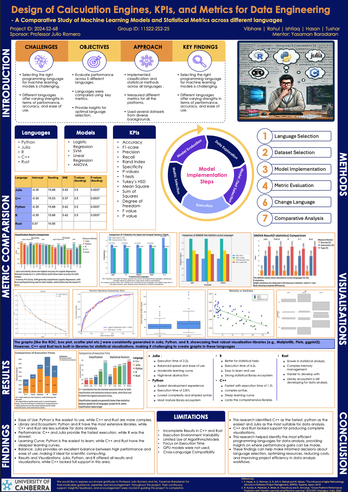

# 📊 Cross-Language Benchmarking of Machine Learning & Statistical Models

**Capstone Project – Master of Data Science, University of Canberra**  
**Sponsor:** Prof. Julio Romero | **Team:** Group 

---

## 📌 Project Overview

This repository contains the **implementation, evaluation, and comparison** of various **Machine Learning** and **Statistical** models across **Python, R, Julia, Rust, and C++**.  
The project was conducted as part of the Master of Data Science Capstone at the University of Canberra in collaboration with Professor Julio Romero.

We evaluated **Logistic Regression (LR)**, **Support Vector Machines (SVM)**, and statistical methods (**ANOVA, MANOVA, Multiple Linear Regression, t-tests, Chi-Square**, etc.) using a **consistent dataset and KPI framework**.

**Goals:**
- Benchmark **execution speed**, **memory usage**, and **model performance**.
- Compare **code complexity** and **ease of implementation** across languages.
- Create an **open, reusable codebase** for future cross-platform ML benchmarking.

---

## 🛠 Languages & Tools

| Language | Libraries Used |
|----------|----------------|
| **Python** | scikit-learn, statsmodels, matplotlib, seaborn |
| **R** | glm, caret, e1071, ggplot2 |
| **Julia** | GLM, LIBSVM, StatsPlots |
| **Rust** | SmartCore, Nalgebra |
| **C++** | STL, Eigen, manual implementations |

---

## 📊 KPI Framework

We measured each model using:

- **Performance Metrics:** Accuracy, Precision, Recall, F1 Score, Specificity
- **Execution Metrics:** Execution Time, Memory Usage
- **Robustness Metrics:** Generalization Error, Training Error, Variance, Purity
- **Statistical Outputs:** p-values, F-values, t-statistics, confidence intervals

---

## 🚀 Key Results

### **1️⃣ Logistic Regression – Performance Comparison**

| Language | Accuracy | Precision | Recall | F1 Score | Specificity | Training Error | Execution Speed |
|----------|----------|-----------|--------|----------|-------------|----------------|-----------------|
| Python   | 0.74     | 0.74      | 0.74   | 0.61     | 0.80        | 0.22           | ⚡ Medium |
| R        | 0.66     | 0.66      | 0.59   | 0.75     | 0.00        | 0.35           | 🐢 Slow |
| Julia    | 0.81     | 0.70      | 0.63   | 0.67     | 0.88        | 0.22           | ⚡ Fast |
| Rust     | 0.72     | 0.72      | 0.69   | 0.71     | 0.75        | 0.25           | ⚡ Fastest |
| C++      | 0.78     | 0.74      | 0.58   | 0.65     | 0.89        | 0.21           | ⚡ Fastest |

**Observation:**  
- Julia achieved **highest accuracy (0.81)**.  
- Rust & C++ had **best execution speeds** with competitive accuracy.  
- R lagged in both execution time and accuracy.

---

### **2️⃣ SVM – Performance Comparison**

| Language | Accuracy | Precision | Recall | F1 Score | Specificity | Training Error |
|----------|----------|-----------|--------|----------|-------------|----------------|
| Python   | 0.75     | 0.74      | 0.75   | 0.55     | 0.88        | 0.22 |
| R        | 0.75     | **0.93**  | 0.66   | 0.77     | 0.90        | 0.26 |
| Julia    | 0.76     | 0.62      | 0.51   | 0.55     | 0.86        | 0.31 |
| Rust     | 0.73     | 0.73      | 0.69   | 0.71     | 0.77        | 0.25 |
| C++      | 0.71     | 0.58      | 0.63   | 0.60     | 0.75        | 0.25 |

**Observation:**  
- R’s SVM had **highest precision (0.93)**.  
- Python balanced **accuracy and ease of implementation**.  
- Julia slightly outperformed Rust in accuracy.

---

### **3️⃣ Statistical Analysis – Consistency Across Languages**

- **MLR:** Julia, Python, R, and C++ produced **identical coefficients, p-values (~0.0037)**, and **t-values (~3.53)**. Rust followed similar trends but lacked detailed statistical output.
- **ANOVA:** Identical results for R, Julia, Python (**p = 0.0211**), small variations in C++ due to manual calculations.
- **MANOVA:** Identical multivariate test statistics for R, Julia, Python.

---

## 📈 Insights & Recommendations

| Language | Strengths | Weaknesses | Best Use Case |
|----------|-----------|------------|---------------|
| **Python** | Easy to learn, rich ML libraries, great for prototyping | Slower than C++/Rust | Rapid ML development |
| **R** | Best for statistical analysis, visualization | Slower execution | Research, statistical modelling |
| **Julia** | High performance + readable syntax | Smaller ecosystem | Scientific computing |
| **Rust** | Memory safe, very fast | Steeper learning curve | High-performance production ML |
| **C++** | Fastest execution, efficient memory | Verbose implementation | Performance-critical ML in production |

---

## 👥 Authors
- Md Mayen Uddin Mozumder Tushar (Research & Analysis, R & Rust Implementation, KPI Design)
- Vibhore Singh, Ishtiaq Chowdhury, Hasan Shariar Chowdhury, Rahul Kisan Dabilkar

